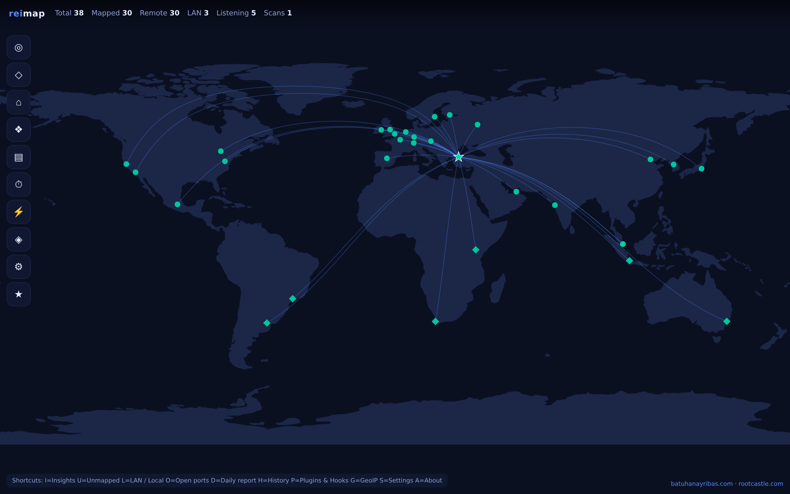
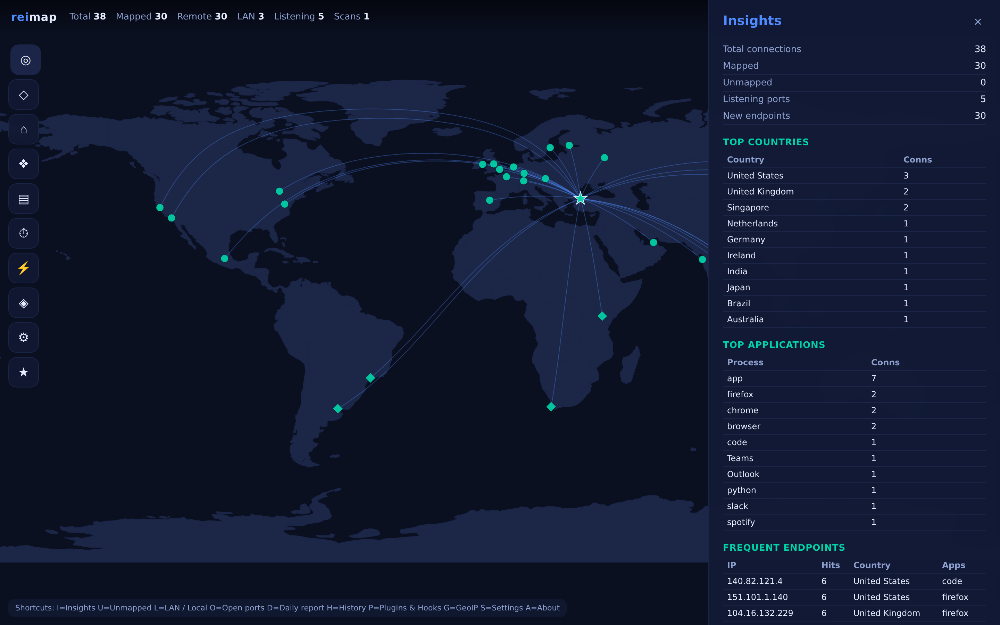
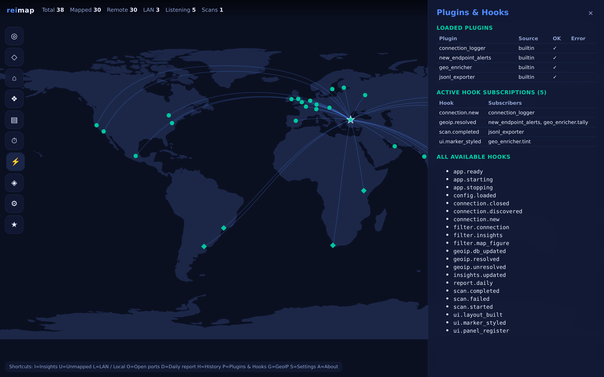
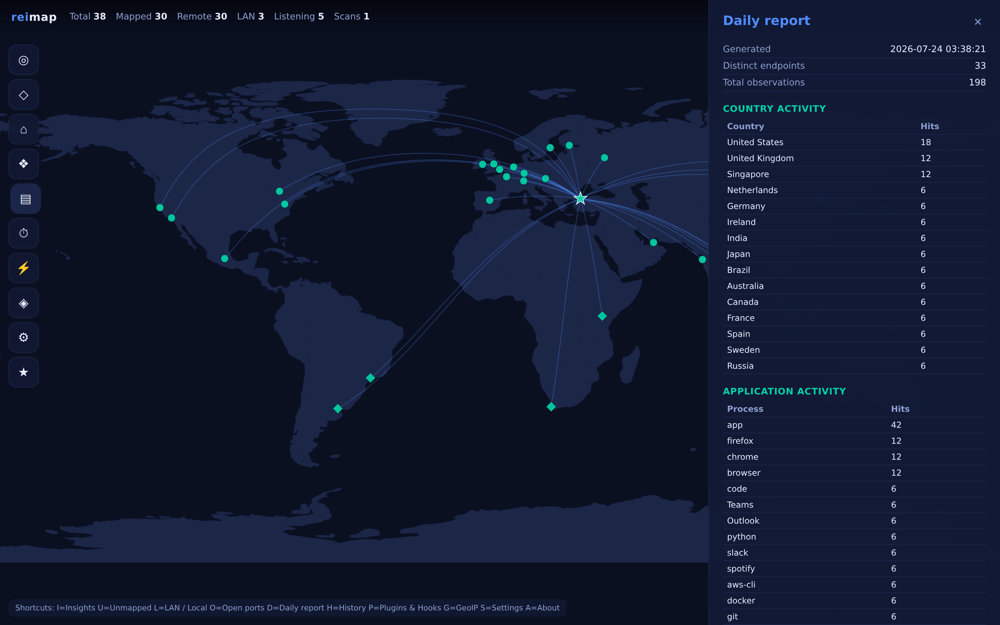
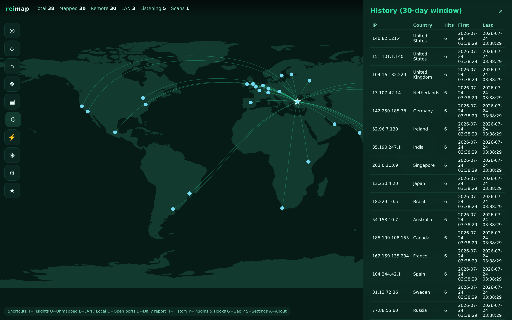
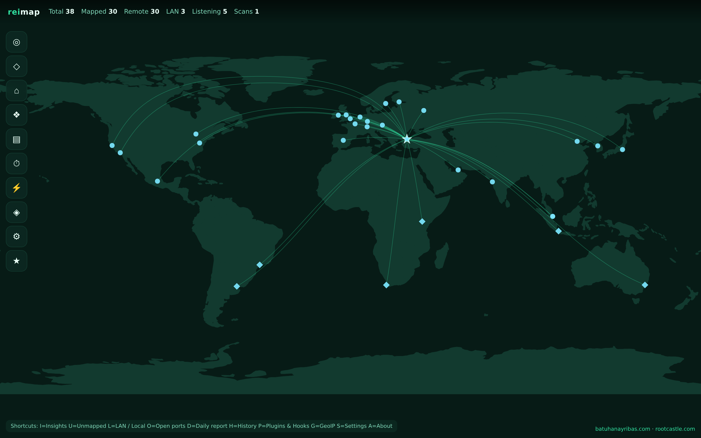
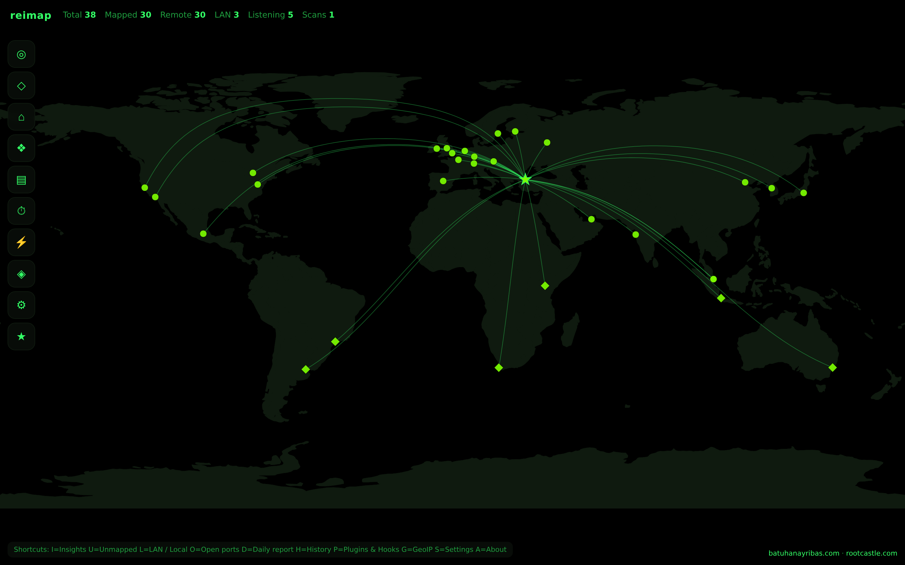
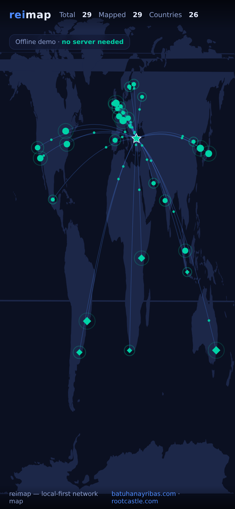

<h1 align="center">reimap</h1>

<p align="center"><b>Watch your machine reach across the internet — in real time.</b></p>

<p align="center">
  <a href="#platforms">Windows · macOS · Linux · Android</a> ·
  local-first · no telemetry · extensible via 21 hooks
</p>

<p align="center">
  
  
  
  
  
  
</p>

<p align="center">
  
</p>

`reimap` is a local-first network observability tool. It watches the sockets your
computer opens, enriches every remote endpoint with geolocation data, and paints
them onto a live, animated world map. Everything runs on your own device: there
is **no telemetry**, no account, and nothing about your traffic ever leaves your
machine.

Where a plain connection list tells you *that* your machine is talking to
`140.82.113.25`, reimap shows you *who*, *where*, and *how often* — with animated
great-circle arcs radiating from your device — and lets you extend every part of
that pipeline through a first-class **hook system**.

> Built by [Batuhan Ayrıbaş](https://batuhanayribas.com) — a
> [Rootcastle](https://rootcastle.com) project. Licensed under the MIT License.

---

## Table of contents

- [Why reimap](#why-reimap)
- [Features](#features)
- [Screenshots](#screenshots)
- [How it works](#how-it-works)
- [Installation](#installation)
- [Quick start](#quick-start)
- [Platforms](#platforms)
- [The interface](#the-interface)
- [Keyboard shortcuts](#keyboard-shortcuts)
- [GeoIP setup](#geoip-setup)
- [The hook system](#the-hook-system)
- [Writing a plugin](#writing-a-plugin)
- [Standards & compliance](#standards--compliance)
- [Configuration](#configuration)
- [Command-line usage](#command-line-usage)
- [Development](#development)
- [Privacy](#privacy)
- [Credits & license](#credits--license)

---

## Why reimap

Modern applications open dozens of connections you never see. reimap makes that
invisible activity legible:

- **See the world behind your apps.** Every established connection becomes a point
  on a map, hoverable for the owning process, protocol and status.
- **Notice what's new.** A rolling history highlights endpoints and countries your
  machine has never contacted before.
- **Stay private by design.** GeoIP resolution happens locally against a database
  you own. reimap never calls home.
- **Extend everything.** reimap ships an event/filter hook system so you can log,
  alert, enrich, redact, or export at any stage without patching the core.

## Features

| Area | What you get |
| --- | --- |
| **Animated live map** | Real-time world map with animated great-circle arcs radiating from your device, travelling packets, pulsing markers, a home origin, five colour themes, five projections, and a density halo. |
| **Fully offline** | The world geometry is bundled — the map draws with **zero external requests**. |
| **Insights** | New endpoints, frequent talkers, top countries, and top applications, recomputed every cycle. |
| **History** | A persisted rolling window (default 30 days) with per-endpoint hit counts, first/last-seen, and country totals. |
| **Daily report** | A compact summary of application patterns, provider/country concentration and busiest endpoints. |
| **Network inspection** | Panels for unmapped services, LAN/local sockets, and listening TCP/bound UDP ports. |
| **GeoIP management** | Install, update and verify a MaxMind GeoLite2-City database from inside the UI. |
| **Hook system** | 21 documented extension points across the whole lifecycle — plus a live in-app **hook inspector**. |
| **Plugins** | Five built-in plugins and drop-in loading of your own from the config directory. |
| **Keyboard-first UI** | Every panel is one keypress away. |
| **Runs everywhere** | Windows, macOS, Linux **and Android** — with a standalone offline demo APK. |
| **Engineered to standards** | Documented to a tailored **MIL-STD-498** set; coded to an adapted **NASA/JPL Power of 10** standard; tested in CI on Python 3.10–3.12. |

## Screenshots

| Insights | Plugins & Hooks (live inspector) |
| --- | --- |
|  |  |

| Daily report | History |
| --- | --- |
|  |  |

| Aurora theme | Terminal theme |
| --- | --- |
|  |  |

**Android — standalone offline demo (no server, no network):**

<p align="center">
  
</p>

## How it works

reimap runs a background scan loop. Each cycle follows a simple pipeline, and every
arrow in it is a hook you can tap:

```
 scan sockets ──▶ FILTER_CONNECTION ──▶ GeoIP lookup ──▶ update store ──▶ insights ──▶ render map
      │                  │                    │               │              │            │
 SCAN_STARTED    (drop / rewrite)      GEOIP_RESOLVED   CONNECTION_NEW  INSIGHTS_    FILTER_MAP_FIGURE
 SCAN_COMPLETED                        GEOIP_UNRESOLVED CONNECTION_CLOSED  UPDATED    UI_MARKER_STYLED
```

The background thread and the web UI communicate only through thread-safe stores,
so a slow render never stalls a scan and a misbehaving plugin never crashes the
loop.

## Installation

reimap targets Python 3.10+.

```bash
# from a clone
git clone https://github.com/rootcastleco/reimap.git
cd reimap
pip install -e .

# or with development tooling (tests + linter)
pip install -e ".[dev]"
```

## Quick start

```bash
reimap
```

reimap starts a scan loop, opens `http://127.0.0.1:8050/` in your browser, and
begins plotting connections. Without a GeoIP database installed, connections still
appear in the **Unmapped** and **Open ports** panels; install a database (see
below) to place them on the map.

```bash
reimap --theme aurora --port 9000 --no-browser
```

**No GeoIP database yet? See it populated instantly with the built-in demo:**

```bash
reimap --demo          # seeds a curated worldwide dataset, no GeoIP needed
```

## Platforms

reimap runs everywhere, with official builds produced by CI.

| Platform | How to get it |
| --- | --- |
| **Linux / macOS / Windows (pip)** | `pip install -e .` then `reimap`. Python 3.10+. |
| **Desktop binary** | Single-folder app built by the [release workflow](.github/workflows/release.yml) via PyInstaller — attached to each GitHub Release for all three OSes. No Python needed. |
| **Docker** | `docker build -t reimap . && docker run --rm --network host --pid host reimap` (Linux host). |
| **Android** | A Kotlin WebView app in [`android/`](android/README.md). Ships a **standalone offline demo** (no server) plus a **connect-to-server** mode. The APK is built by CI and attached to releases. |

> **Architecture note.** On Android the privileged socket scanning runs on the
> desktop/server engine (Python); the phone renders — either the bundled offline
> demo, or a live desktop instance you point it at. This keeps the APK tiny and
> permission-light.

## The interface

- **Top status bar** — live counters: total / mapped / remote / LAN / listening /
  scans.
- **Left menu rail** — one button per panel; the active panel is highlighted.
- **Right drawer** — hosts the active panel and refreshes on its own interval.
- **Footer** — links to [batuhanayribas.com](https://batuhanayribas.com) and
  [rootcastle.com](https://rootcastle.com).

Panels: **Insights**, **Unmapped**, **LAN / Local**, **Open ports**,
**Daily report**, **History**, **Plugins & Hooks**, **GeoIP**, **Settings**,
**About**.

## Keyboard shortcuts

| Key | Panel | Key | Panel |
| --- | --- | --- | --- |
| `I` | Insights | `H` | History |
| `U` | Unmapped | `P` | Plugins & Hooks |
| `L` | LAN / Local | `G` | GeoIP |
| `O` | Open ports | `S` | Settings |
| `D` | Daily report | `A` | About |
| `Esc` | Close the drawer | | |

Shortcuts are handled entirely in the browser, so they never round-trip to the
server.

## GeoIP setup

reimap never bundles GeoIP data (to stay licence-clean and telemetry-free). Two
ways to install it:

1. **From the UI.** Create a free [MaxMind](https://www.maxmind.com/) account,
   generate a licence key, paste it into **Settings → MaxMind licence key**, and
   press **Update GeoIP**. reimap downloads and extracts GeoLite2-City for you.
2. **Manually.** Drop a `GeoLite2-City.mmdb` file into reimap's cache directory
   (shown in the **GeoIP** panel).

## The hook system

The hook system is what sets reimap apart. There are two flavours:

- **Event hooks** — fire-and-observe. Subscribers receive a context mapping and
  their return value is ignored. Example: `connection.new`, `scan.completed`.
- **Filter hooks** — each subscriber receives the running value and returns a
  (possibly modified) replacement; returning `None` drops it. Example:
  `filter.connection` (drop/rewrite a connection before it is mapped).

Callbacks carry a numeric **priority** (lower runs first), exceptions are isolated
and logged, and the registry is fully **introspectable** — the **Plugins & Hooks**
panel lists every hook and every active subscriber live.

List every available hook from the CLI:

```bash
reimap --list-hooks
```

See [HOOKS.md](HOOKS.md) for the complete reference of all 21 hooks and their
context payloads.

## Writing a plugin

A plugin is any Python module exposing `register(hooks, runtime)`. Drop it into
`<config>/plugins/` (the path is shown in the GeoIP panel) and enable it in the
config. Here is a complete plugin that beeps in the log for every connection to a
new country:

```python
# ~/.config/reimap/plugins/country_watch.py
from reimap.hooks import HookName

def register(hooks, runtime):
    seen = set()

    @hooks.on(HookName.GEOIP_RESOLVED, name="country_watch", priority=80)
    def _on_resolved(ctx):
        country = ctx["location"].country
        if country and country not in seen:
            seen.add(country)
            print(f"[country_watch] first contact with {country}")
```

reimap ships five built-in plugins you can copy as starting points:

| Plugin id | What it does | Hook(s) used |
| --- | --- | --- |
| `connection_logger` | Logs every first-seen endpoint | `connection.new` |
| `new_endpoint_alerts` | Warns on first contact with a new country | `geoip.resolved` |
| `private_ip_filter` | Hides LAN/local sockets from the map | `filter.connection` |
| `geo_enricher` | Tallies hemispheres, restyles southern markers | `geoip.resolved`, `ui.marker_styled` |
| `jsonl_exporter` | Appends every scan to an audit `scans.jsonl` | `scan.completed` |

Enable plugins via the `enabled_plugins` list in the config file.

## Standards & compliance

reimap is engineered to the discipline of a controlled software project, not just
"an app that works." Two industry standards are applied — and documented — in full:

- **MIL-STD-498** (*Software Development and Documentation*). A tailored
  documentation set lives in [`docs/mil-std-498/`](docs/mil-std-498/): a
  Requirements Specification (SRS) with numbered requirements, a Design Description
  (SDD), a Test Description (STD), a Development Plan (SDP), a Version Description
  (SVD), and a bidirectional **Requirements Traceability Matrix** (RTM) linking
  every requirement → design element → verifying test.
- **NASA/JPL "Power of 10"** rules for safety-critical code, adapted to Python
  ([`docs/mil-std-498/coding-standard.md`](docs/mil-std-498/coding-standard.md)):
  bounded loops, boundary assertions, checked return values, minimal-scope state,
  and a project-specific **fail-soft** rule — *no plugin or hook can ever crash a
  scan cycle or the server*.

Both are enforced continuously: `ruff` static analysis and the full `pytest` suite
run in [CI](.github/workflows/ci.yml) on Python 3.10, 3.11 and 3.12.

## Configuration

Configuration lives in a JSON file under your platform config directory
(`reimap` / `rootcastle`). It is created with sensible defaults on first run.
Notable keys:

| Key | Default | Meaning |
| --- | --- | --- |
| `scan_interval_seconds` | `3.0` | Seconds between scans (min `0.5`). |
| `history_days` | `30` | Rolling history retention window. |
| `frequent_threshold` | `5` | Hits before an endpoint counts as "frequent". |
| `theme` | `midnight` | One of `midnight`, `aurora`, `carbon`, `daylight`, `terminal`. |
| `map_style` | `natural_earth` | Plotly projection. |
| `port` / `host` | `8050` / `127.0.0.1` | Web server bind address. |
| `enabled_plugins` | `["connection_logger"]` | Built-in plugins to load. |

## Command-line usage

```
reimap [--host HOST] [--port PORT] [--theme THEME] [--interval SECONDS]
       [--no-browser] [--list-hooks] [--debug] [--version]
```

## Development

```bash
pip install -e ".[dev]"
pytest            # run the test suite
ruff check .      # lint
```

The codebase is organised by responsibility — see [ARCHITECTURE.md](ARCHITECTURE.md)
for the module map and design notes.

## Privacy

reimap is local-first and telemetry-free. See [PRIVACY.md](PRIVACY.md) for the
details of what is (and is not) stored on your machine.

## Credits & license

reimap is designed and built by **[Batuhan Ayrıbaş](https://batuhanayribas.com)**
under the **[Rootcastle](https://rootcastle.com)** umbrella.

Released under the [MIT License](LICENSE). This project is an independent,
original implementation inspired by the concept of live socket-to-map
visualisation; it shares no source code with any other project.

GeoLite2 data, if you install it, is © MaxMind and subject to MaxMind's own
licensing terms.
